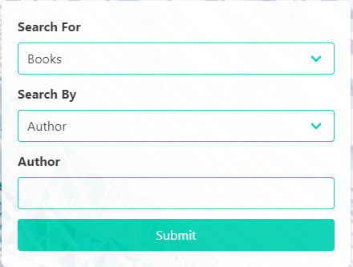

# Media 4U
 
## Links
* Repository: https://github.com/ZQWhiting/media4u
* Live URL: https://ZQWhiting.github.io/media4u

## Technologies Used
* Bulma
* The Movie Database
* Google API's

## Description

* Media4U was created taking our current situation in mind. With quarantine's around the world finding media has become more important than ever, and that's what Media4U strives to accomplish. Search movies by Year Released, Keyword/Title and Genre, search for books by Keyword/Title or Author. You can also save items you're interested in and these will remain in place even after refresh! Not interesed in a book or movie anymore? Then get rid of it quickly and easily.

## Website Look/Layout

### Home Screen

- User is greeted with a home screen that is easy to understand. They can select between searching movies or books. Once a type is selected the modal will dynamically adjust. For movies the user can select between Genre, Year, Keyword. For books, the user can select to search between Keyword or Author. The text above the search bar will change dynamically based on what the user has chose, either "Keyword or Author".

Home Screen: 

Movie Search Selected: 

Book Search Selected (Keyword): 

Book Search Selected (Author): 

### Search Ran

- Once the user searches they are automatically scrolled down the page to their results.

Movie Results:  

Book Results: 

### Poster Selected

- If a user decides to select a book or movie they are greeted with a modal displaying the information about the selected item. On this same modal a user may choose to exit back to results by selecting the "x" in the upper right corner, or select the button labeled "Add to interests".

Movie Clicked: 

Book Clicked: 

### Add to interests

- If a user does decide to select "Add to interests" it is saved under the clearly marked "Saved Interests" button in the upper right corner of the web page. Once selected the user can see their previously selected choices under either the movie or books tab.

Movie Tab Interests: 

Book Tab Interests: 

- These items will remain in place even after refresh.

## Project Requirements

### Use a CSS framework other than Bootstrap.

- For this project our team decided to go with Bulma.

Website: https://bulma.io/

### Be deployed to GitHub Pages.

- As listed above our site is live and can be found at https://ZQWhiting.github.io/media4u

### Be interactive (i.e: accept and respond to user input).

- Media4U responds to a variety of user inputs. For movies, search by genre, movie title/keyword, and/or the year the movie was released. For books, you can search by Author and/or title/keyword.

### Use at least two server-side APIs.

- The 2 API's we decided to use was "The Movie Database" for movies and "Google API's" for books.

### Does not use alerts, confirms, or prompts (use modals).

- Media4U does not have any alerts, instead we have a couple options that may happen if the user does get an error. 1) If the user searches for a book or movie and no results can be found the site will scroll down as if there was results but where the movie posters would normally be they will instead see a message "No results. Please try a different search".

Example "No Results": 

- If there are issues fetching results, or server side issues they will be met with a modal informing the user an error has occured.

Example "Server Side": 

### Use client-side storage to store persistent data.

- Media4u as mentioned above takes advantage of client-side storage in order to store what the user has added to their "Saved Interests". When a user selects a movie poster they are met with more inforamtion about that movie. They also will see a clear, clickable box that reads "Add to interests". If this box is selected the user can then at anytime select "Saved Interests" on the main page and see all that they've favorited, even after refresh. If the user is wanting to remove the item from their interests they may do so by selecting the "X" next to the title.

### Be responsive.

- Media4U properly sizes to all screen sizes.

### Have a polished UI.

- Media4U has a clean straight forward design, that is sleek, easy to use and displays all the information a user may want in an easy to understand way.

### Have a clean repository that meets quality coding standards (file structure, naming conventions, follows best practices for class/id-naming conventions, indentation, quality comments, etc.).

- Commits have messages stating their intent, code has been refactored to provide not only clean code and format but also prepared to take on future features.

### Have a quality README (with unique name, description, technologies used, screenshot, and link to deployed application). 

- All of this information can be found throughout the README. Links are located first thing with clear titles for what each link is for.

## Creators
- Zachary Whiting
- Taylor Remigi
- Mason Marinko
- Rafa DeLima
